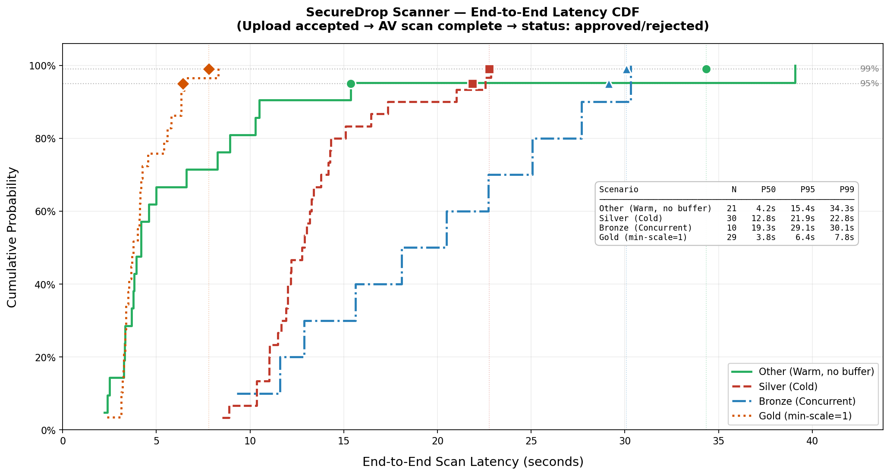

# SecureDrop — SLA Measurements

## Overview

This document describes the methodology, scripts, and results of the SLA
(Service Level Agreement) performance measurements conducted for the
SecureDrop serverless scanning pipeline.

### Measured metric

```
End-to-end scan latency =
  time from successful upload (HTTP 201)
  until API receives status change: approved/rejected
```

### Pipeline under measurement

```
Upload → API → MinIO (quarantine) → RabbitMQ → Node-RED → Knative Scanner → ClamAV
                                                                           → MinIO (approved/rejected)
                                                                           → API status update
```

---

## Repository structure

```
sla measurements/
├── README.md                          # This file
├── scripts/
│   ├── generate_test_files.sh         # Generates unique binary test files
│   ├── measure_warm_sla_unique.sh     # Scenario A: Warm execution
│   ├── measure_cold_sla_unique.sh     # Scenario B: Cold start (scale-to-zero)
│   ├── measure_concurrent_sla_unique.sh  # Scenario C: 10 parallel uploads
│   └── analyze_sla.py                 # CDF analysis and plot generation
├── results/
│   ├── warm_final.csv                 # Scenario A results (21 samples)
│   ├── cold_clean.csv                 # Scenario B results (30 samples)
│   ├── concurrent_final.csv           # Scenario C results (20 samples)
│   ├── minscale1_clean.csv            # Scenario D results (29 samples)
│   └── sla_cdf_plot.png               # CDF plot (all 4 scenarios)
```

---

## Prerequisites

```bash
# On the MicroK8s cluster node
sudo apt-get install -y jq curl python3-matplotlib

# Verify microk8s kubectl is available
microk8s kubectl version --client
```

---

## Bearer Token

All upload requests require a Keycloak Bearer token.

**Important:** The default Keycloak token lifetime is 20 minutes. For long
test runs (especially cold start), increase it first:

```
Keycloak Admin → securedrop-realm → Realm Settings → Tokens
→ Access Token Lifespan → 60 minutes → Save
```

Then obtain a token:

```bash
export TOKEN=$(curl -s -X POST \
  'https://auth.securedrop.gr/realms/securedrop/protocol/openid-connect/token' \
  -d 'grant_type=password' \
  -d 'client_id=securedrop-client' \
  -d 'username=YOUR_USER' \
  -d 'password=YOUR_PASS' \
  | jq -r '.access_token')
```

---

## Step 0 — Generate unique test files

The SecureDrop platform implements **deduplication** (Idempotency pattern).
Uploading the same file twice results in no re-processing. Each test run
therefore requires a unique file generated from `/dev/urandom`.

```bash
chmod +x scripts/generate_test_files.sh
./scripts/generate_test_files.sh ./load-files 50 10

# Creates:
#   load-files/unique-10mb-1.bin  ...  unique-10mb-50.bin
#   load-files/concurrent-10mb-1.bin  ...  concurrent-10mb-30.bin

# For min-scale=1 scenario, generate additional files:
for i in $(seq 1 30); do
  dd if=/dev/urandom of=./load-files/minscale1-10mb-${i}.bin \
     bs=1M count=10 2>/dev/null
done
```

> **Note:** `kubectl` on this system triggers segfaults. All scripts use
> `microk8s kubectl` instead. Run the following before executing scripts:
> ```bash
> sed -i 's/kubectl /microk8s kubectl /g' scripts/*.sh
> ```

---

## Scenario A — Warm execution (Gold SLA)

The scanner pod is already running before each upload.
Measures steady-state latency without cold-start overhead.

```bash
chmod +x scripts/measure_warm_sla_unique.sh

RUNS=21 \
RECIPIENT_EMAIL='adreas@karabetian.gr' \
OUTPUT=results/warm_final.csv \
./scripts/measure_warm_sla_unique.sh ./load-files
```

**Duration:** ~5 minutes

---

## Scenario B — Cold start (Silver SLA)

The scanner scales to zero before each upload.
Measures the full cold-start penalty: pod creation + Vault secret injection
+ Node.js startup + ClamAV TCP stream.

**Knative tuning before running:**

```bash
# Reduce window to minimum (6s) for faster scale-to-zero between runs
microk8s kubectl patch ksvc securedrop-scanner -n default \
  --type merge \
  -p '{"spec":{"template":{"metadata":{"annotations":{
    "autoscaling.knative.dev/window":"6s"
  }}}}}'

# Reduce timeoutSeconds so Terminating pods clear faster (60s vs 300s default)
microk8s kubectl patch ksvc securedrop-scanner -n default \
  --type merge \
  -p '{"spec":{"template":{"spec":{"timeoutSeconds":60}}}}'
```

```bash
chmod +x scripts/measure_cold_sla_unique.sh

RUNS=30 \
RECIPIENT_EMAIL='adreas@karabetian.gr' \
OUTPUT=results/cold_clean.csv \
./scripts/measure_cold_sla_unique.sh ./load-files
```

**Duration:** ~15 minutes (run inside `tmux`)

**Restore after test:**

```bash
microk8s kubectl patch ksvc securedrop-scanner -n default \
  --type merge \
  -p '{"spec":{"template":{"metadata":{"annotations":{
    "autoscaling.knative.dev/window":"10s"
  }}}}}'

microk8s kubectl patch ksvc securedrop-scanner -n default \
  --type merge \
  -p '{"spec":{"template":{"spec":{"timeoutSeconds":300}}}}'
```

---

## Scenario C — Concurrent uploads (Bronze SLA)

10 files uploaded simultaneously. Measures queue latency and burst behavior.

```bash
chmod +x scripts/measure_concurrent_sla_unique.sh

CONCURRENCY=10 \
BATCHES=3 \
RECIPIENT_EMAIL='adreas@karabetian.gr' \
OUTPUT=results/concurrent_final.csv \
./scripts/measure_concurrent_sla_unique.sh ./load-files
```

**Duration:** ~5 minutes

> **Observation:** Only 1 scanner pod is created during concurrent uploads.
> Node-RED consumes RabbitMQ messages with `prefetch=1` (serial processing),
> so the Knative scanner receives requests one at a time. The `containerConcurrency=5`
> setting is never utilized — Node-RED is the bottleneck, not the scanner.

---

## Scenario D — Always-warm (min-scale=1 comparison)

Tests the alternative autoscaling strategy where a minimum of 1 pod is
always running (no scale-to-zero). Supports section 6.6 of the design document.

```bash
# Enable min-scale=1
microk8s kubectl annotate ksvc securedrop-scanner -n default \
  autoscaling.knative.dev/min-scale=1 --overwrite

# Wait for pod to be running
microk8s kubectl get pods -n default | grep securedrop-scanner

# Run measurement
FILE_PREFIX=minscale1-10mb \
RUNS=30 \
RECIPIENT_EMAIL='adreas@karabetian.gr' \
OUTPUT=results/minscale1_clean.csv \
./scripts/measure_warm_sla_unique.sh ./load-files

# Restore min-scale=0 after test
microk8s kubectl annotate ksvc securedrop-scanner -n default \
  autoscaling.knative.dev/min-scale=0 --overwrite
```

**Duration:** ~5 minutes

---

## CDF Analysis

```bash
python3 scripts/analyze_sla.py \
  "Gold (Warm)":results/warm_final.csv \
  "Silver (Cold)":results/cold_clean.csv \
  "Bronze (Concurrent)":results/concurrent_final.csv \
  "Gold+ (min-scale=1)":results/minscale1_clean.csv \
  --output results/sla_cdf_plot.png
```

---

## Results

| Scenario | N | Mean | P50 | P95 | P99 | Max |
|---|---|---|---|---|---|---|
| Gold (Warm, scale-to-zero) | 21 | 7.1s | 4.2s | 15.4s | 34.3s | 39.1s |
| Silver (Cold start) | 30 | 13.5s | 12.8s | 21.9s | 22.8s | 22.8s |
| Bronze (10× concurrent) | 20 | 10.9s | 10.0s | 23.4s | 26.9s | 27.8s |
| Gold+ (min-scale=1) | 29 | 4.3s | 3.8s | 6.4s | 7.8s | 8.3s |

### SLA Class definitions

| Class | Scenario | Condition | P99 target |
|---|---|---|---|
| **Gold+** | min-scale=1 (always warm) | ≥1 pod always running | ≤ 8s |
| **Silver** | Cold start (scale-to-zero) | Pod starts from zero | ≤ 23s |
| **Bronze** | 10× concurrent burst | 10 parallel uploads | ≤ 27s |

### Key findings

**1. scale-to-zero without min-scale=1 is unpredictable.**
The "Gold (Warm)" scenario has P99=34s — worse than Cold (P99=23s).
Its bimodal CDF reveals that scale-to-zero occasionally fires between
sequential test runs, causing hidden cold starts. The high stdev (8.1s)
confirms this instability.

**2. min-scale=1 is the only reliable "Gold" strategy.**
P99=7.8s with stdev=1.3s. Consistent, predictable, no cold-start variance.
Trade-off: one pod always running = higher resource cost.

**3. Concurrent bottleneck is Node-RED, not the scanner.**
Node-RED processes RabbitMQ messages serially (prefetch=1). Under 10
concurrent uploads, the 10th file waits ~9 × scan_time in the queue.
Only 1 Knative pod is ever needed — the autoscaler never triggers
scale-up because requests arrive sequentially at the scanner.

**4. Cold start overhead is consistent and predictable.**
The Silver CDF is smooth with low variance (stdev=3.5s), confirming
that the cold-start pipeline (Vault injection + Node.js + ClamAV) has
a stable overhead regardless of file content.

---

## CDF Plot


